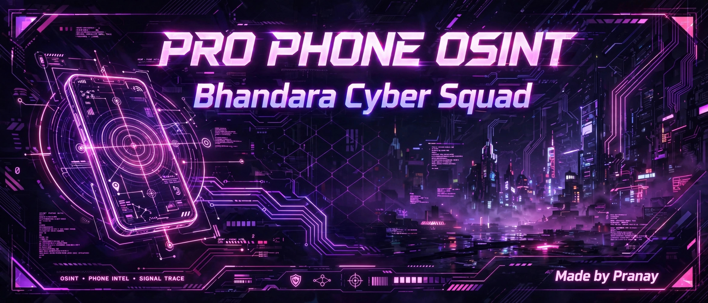

# PRO PHONE OSINT - Bhandara Cyber Squad 💀

### By Pranay aka Pranav Leak Hunter

Advanced Phone OSINT Tool for Ethical Hackers.

### Features:
- ✅ Valid / Invalid Check
- 📶 Operator (Jio, Airtel, Vi)
- 📍 Circle / State Location
- 🕒 Timezone
- 🔍 Public OSINT Links (Truecaller, Eyecon, WhosCall)

### Install:
# Termux installation 
pkg update && pkg upgrade -y
pkg install python git -y
git clone https://github.com/Pranay7030/PRO-PHONE-OSINT-.git
cd PRO-PHONE-OSINT-
pip install -r requirements.txt
python PRO-PHONE-OSINT.py

# Linux Installation 
sudo apt update && sudo apt install python3 git -y
git clone https://github.com/Pranay7030/PRO-PHONE-OSINT-.git
cd PRO-PHONE-OSINT-
pip3 install -r requirements.txt
python3

# DISCLAIMER - READ CAREFULLY ⚠️
 FOR EDUCATIONAL PURPOSE ONLY </h1>
 This tool is created for ETHICAL HACKING & LEARNING.</h3>

*❌ DO NOT USE FOR ILLEGAL ACTIVITY ❌* 
Creator is NOT responsible for any misuse. 
<b>Use at your own risk.</b>

---

🌟# SUPPORT THE PROJECT 🌟

<h1> ⭐ PLEASE GIVE A STAR ⭐ </h1>
<h2> Bhandara Cyber Squad Ko Support Karo! </h2>
<h3> Bhandara Se Nagpur Tak Full Power! 💀🔥 </h3>

# *GitHub: @Pranay7030*

---

 Made with ❤️ by Pranay 

