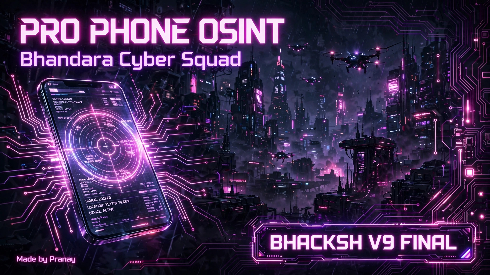

# 👻 BHACKSH OSINT V9 FINAL - By PRANAY


> **"SOLO GHOST // BHANDARA // ONE MAN ARMY"**
> Advanced OSINT Tool for Phone, IP, and Social Intelligence.

---

### 🔥 FEATURES
- **📱 Phone OSINT** - Number info, carrier, location tracing
- **🌍 IP Tracker** - IP to City/Country + Live Google MAP + QR Generator
- **📸 Ghost Insta** - Instagram OSINT module
- **🗺️ MAP + QR** - Auto saves `IP_map.png` in gallery for proof
- **👻 Custom Logo** - BHACKSH V9 FINAL compact ghost banner
- **⚡ Fast & Lightweight** - Made for Termux

---

### 📲 INSTALLATION - TERMUX

```bash
pkg update && pkg upgrade -y
pkg install python git -y
git clone https://github.com/Pranay7030/PRO-PHONE-OSINT-
cd PRO-PHONE-OSINT-
pip install -r requirements.txt
python osint.py
### 📲 INSTALLATION - LINUX
sudo apt update && sudo apt install python3 git -y
git clone https://github.com/Pranay7030/PRO-PHONE-OSINT-
cd PRO-PHONE-OSINT-
pip3 install -r requirements.txt
python3 osint.py
